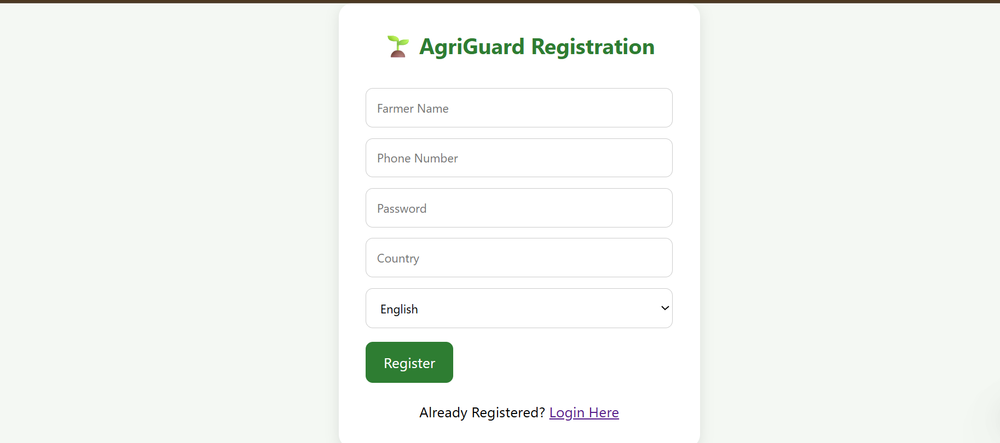
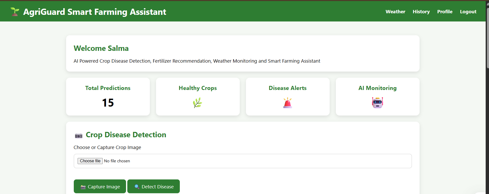
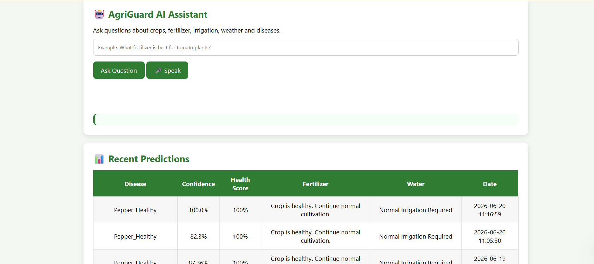
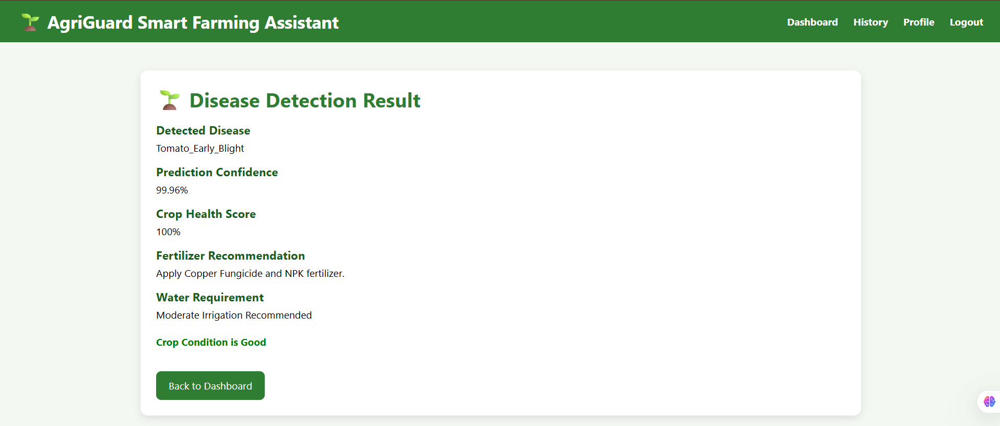
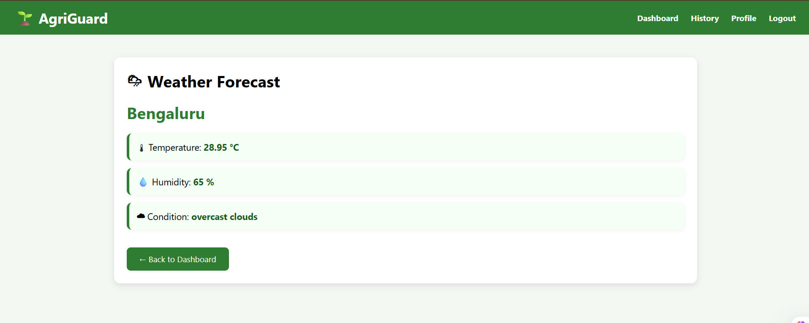
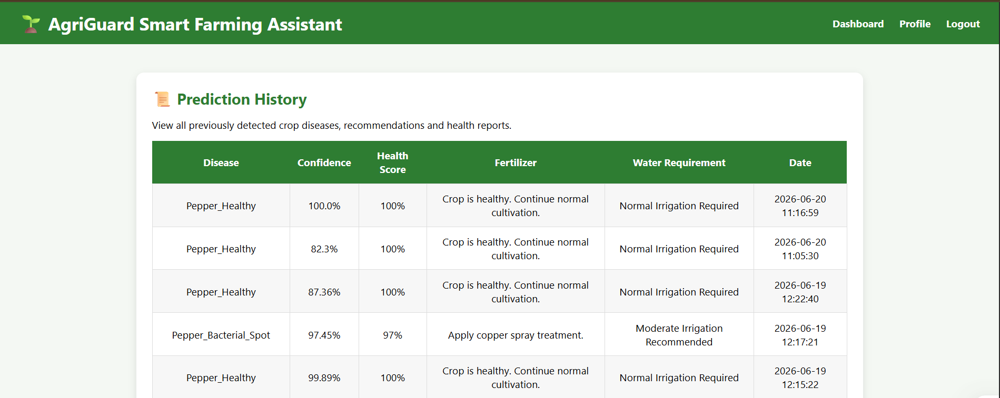
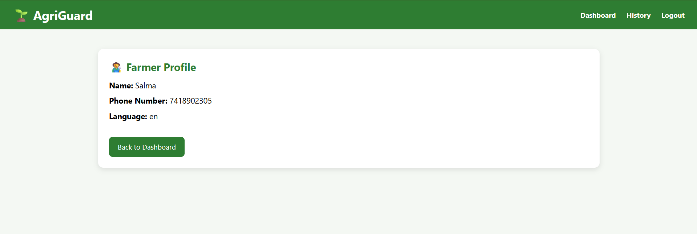
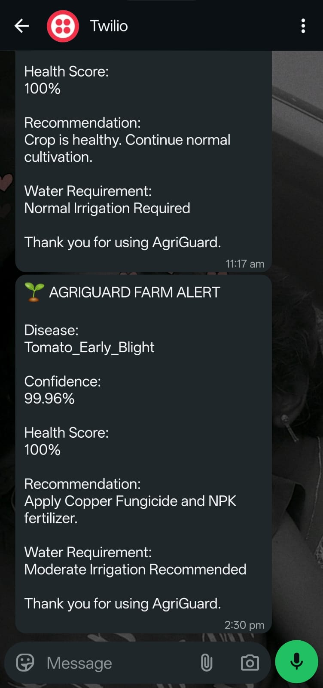

# AgriGuard

AI Powered Smart Farming Assistant with Crop Disease Detection, Weather Monitoring and AI Assistant

# 🌱 AgriGuard Smart Farming Assistant

AgriGuard is an AI-powered smart farming platform that helps farmers detect crop diseases, receive fertilizer recommendations, monitor weather conditions, interact with an AI farming assistant, and receive WhatsApp alerts.

## 🚀 Features

- Crop Disease Detection using Deep Learning
- Fertilizer Recommendation System
- Smart Irrigation Recommendation
- Weather Forecast Integration
- AI Farming Assistant (Voice + Text)
- WhatsApp Alert Notifications
- Farmer Registration & Login
- Prediction History Tracking
- Farmer Profile Management

## 🛠 Technologies Used

- Python
- Flask
- TensorFlow / Keras
- MySQL
- HTML
- CSS
- JavaScript
- Twilio WhatsApp API

## 📷 Project Screenshots

### Login Page

### Registration Page

### Dashboard

### Dashboard

### Disease Detection Result

### Weather Forecast

### Prediction History

### Farmer Profile

### WhatsApp Alert

## 👩‍💻 Developer

Salma S

Computer Science Engineering Student

AI & Machine Learning Enthusiast
